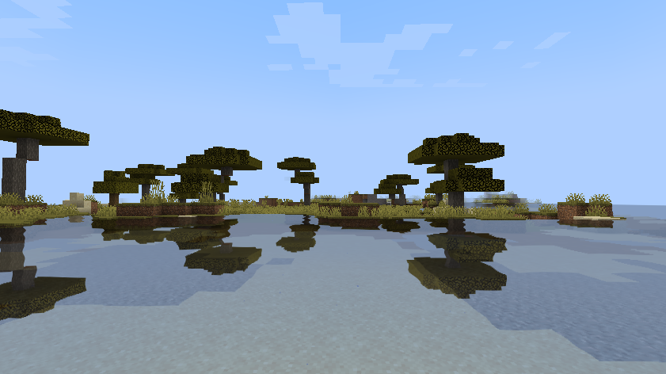
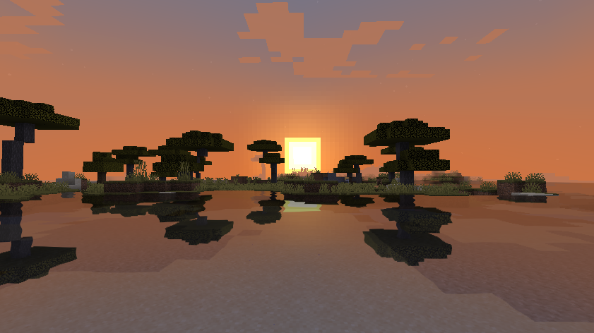

# Water Shader Mod

<div style="text-align:center"></div>
<div style="text-align:center"></div>
<div style="text-align:center"></div>

## Table of Contents
- [Introduction](#introduction)
- [Features](#features)
- [Why Not Optifine?](#why-not-optifine)
- [How Does It Work?](#how-does-it-work)
- [Setup](#setup)
- [Known Issues](#known-issues)
- [Requirements](#requirements)
- [License](#license)

## Introduction
The Water Shader Mod is a Minecraft mod that adds water reflection and refraction to the game to make the water look more realistic.
This mod is highly inspired by the [Water Shader Mod](https://minecraft.fr/1-1-water-shaders/) for Minecraft 1.1 by Necrowizzard.
However, it does not borrow any code from the original mod.

## Features
- Water reflection
- Water refraction
- Fresnel effect
- Distortion effect

## Why Fabric For Shading?
Most of Minecraft shaderpacks are built upon the Optifine pipeline to take advantage of the framerate boost and its features to write GLSL code.
However, Optifine does not provide any API to modify JAVA code and customize the way Minecraft renders the world.
In order to address this issue, we can use the Fabric API to hook into the rendering pipeline and modify Minecraft's rendering pipeline.

## How Does It Work?
The mod uses the planar reflection technique to render the reflection of the world on the water surface. The reflection is then blended with the water color to create the final water effect.
To know more about the planar reflection technique, please take a look at ThinMatrix's tutorial videos [OpenGL Water Shader](https://www.youtube.com/watch?v=HusvGeEDU_U&ab_channel=ThinMatrix) which helped to create this mod.
Most of Minecraft shaders use the [screen-space reflection](https://en.wikipedia.org/wiki/Screen_space_reflection) technique to render reflections on the water surface.
While this technique is fast and independent of world geometry, it has two major drawbacks:
- Only objects visible on screen are reflected on the water surface.
- Left and right sides of the screen do not have any reflection.

Screen-space reflection uses screen information to render world reflections on water. This means that only objects visible on screen are reflected on the water surface.
Hence, if the player looks down at his feet, no reflection would be visible. The same goes for the sides of the screen.
Planar reflection, on the other hand, does not suffer from this issue, and it renders mirror-like reflections regardless of the player's view direction.
This method requires you to define a plane as reference to calculate reflections on some water surface. This plane is defined by the water height position and the water normal. 
However, planar reflection allows only one water plane height coordinate to be used for the whole world. This means that all water blocks should be at the same height to show accurate reflection.
Minecraft's worlds can possess water at different heights, thus reflections would not render properly everywhere, so only water at sea level (Y=62) benefits from reflections.
Water blocks located at different heights are rendered with a simple water shader that uses refraction and distortions.

## Setup
To set up the environment:
- Clone the repository.
```git clone https://github.com/JimPavan/Water-Shader-Mod.git```
- Open the project in IntelliJ IDEA.
- Run the gradle task `genSources` to generate the sources.
- Run the gradle task `runClient` to run the mod.

You can also follow the standard tutorial on [fabric wiki page](https://fabricmc.net/wiki/tutorial:setup).

## Known Issues
- Third person mode renders visual artifacts due to incorrect camera transformation.
- Bobbing animation (BobView) is cancelled to avoid reflection visual artifacts on water surface.
- The same goes for tilted camera when player is damaged (WIP).
- Player sneak and crouch creates visual artifacts on water surface.
- Water Shader Mod is incompatible with Optifine and Sodium.
- On MAC, refraction framebuffer not resizing.

## Requirements
 - Minecraft 1.19.4
 - Fabric API
 - IntelliJ IDEA
 - Windows OS (MAC works but with visual artifacts, Linux not tested)

## License
This template is available under the CC0 license. Feel free to learn from it and incorporate it in your own projects.
